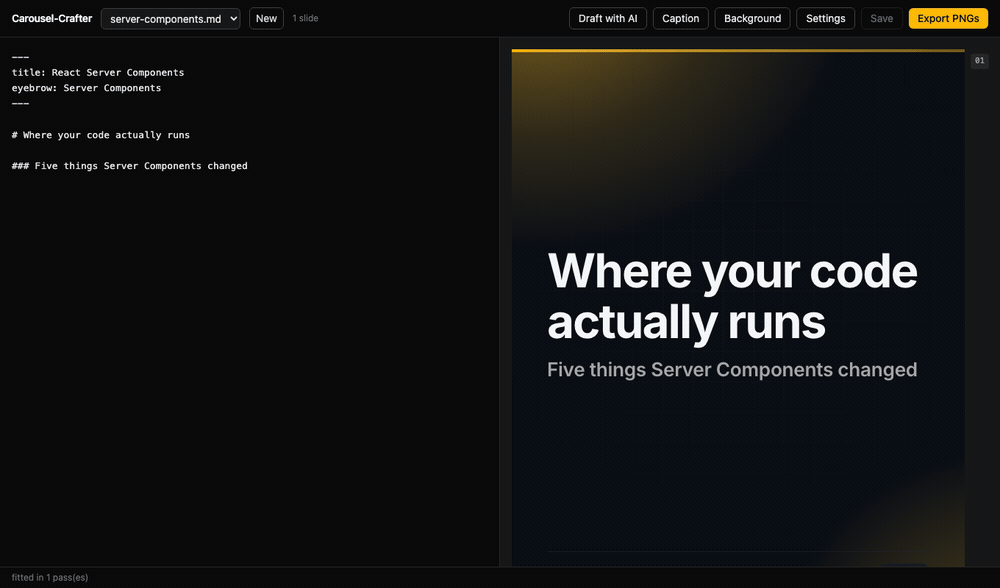
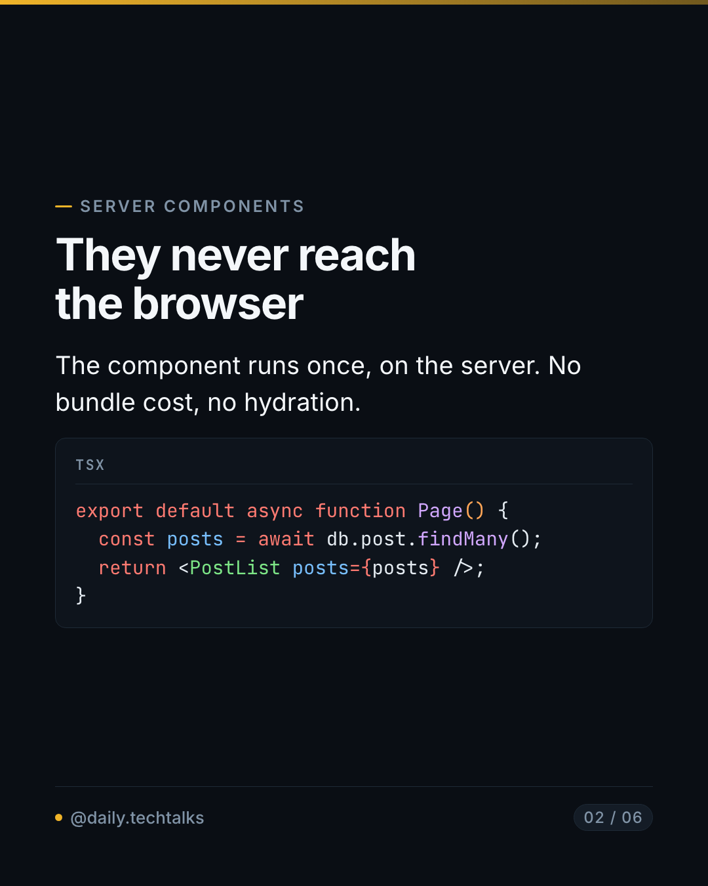
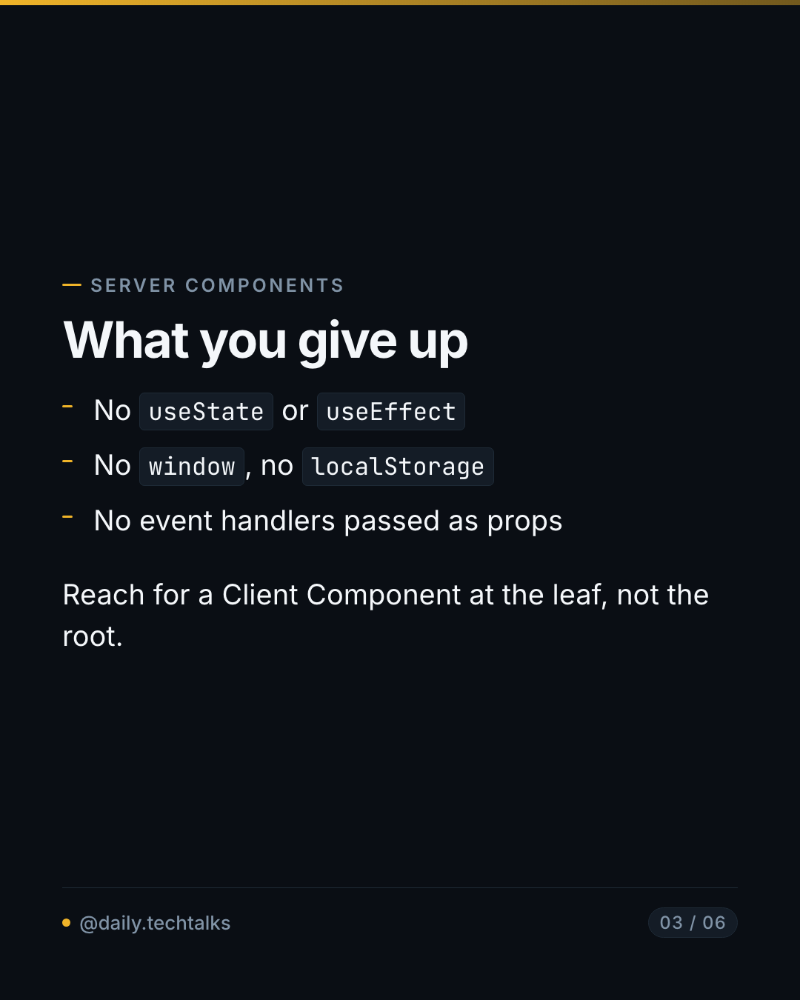
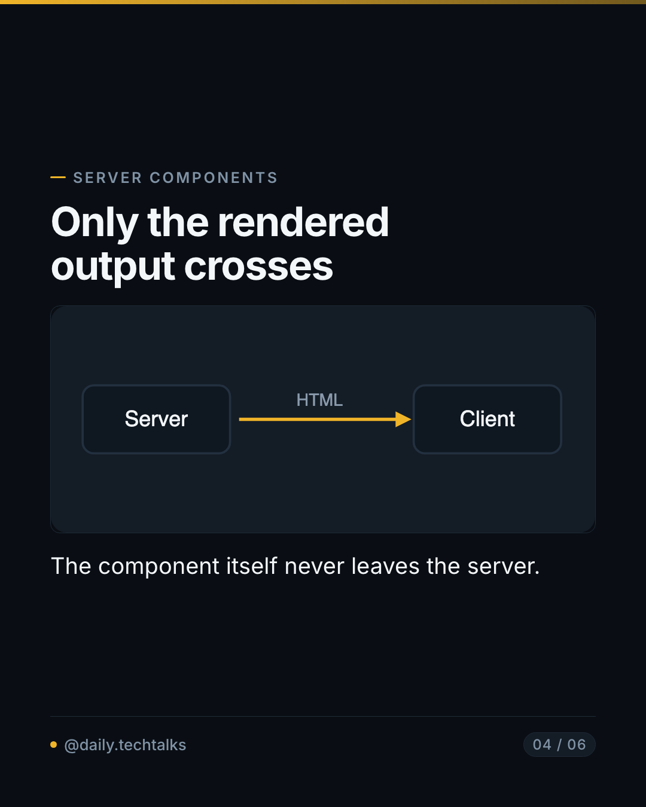
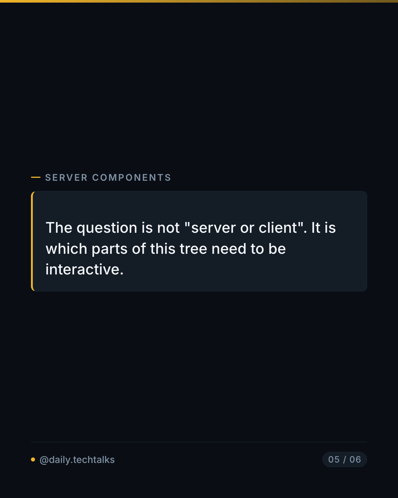
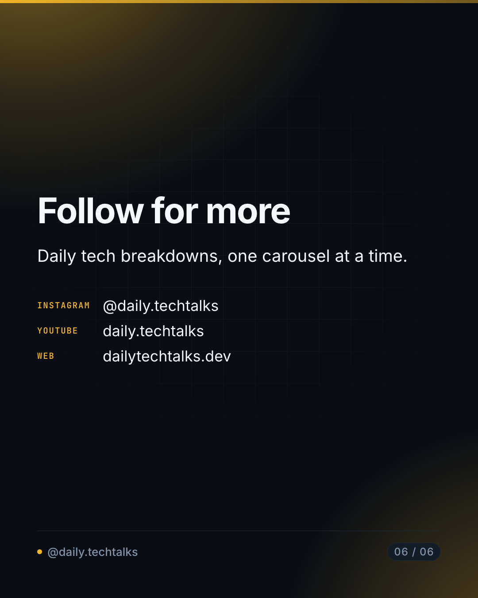

<p align="center">
  
</p>

<p align="center">
  Write a post in Markdown. Get ten posting-ready Instagram slides.<br>
  No Figma, no Canva, no dragging text boxes until they fit.
</p>

<p align="center">
  
</p>

<p align="center">
  <em>Type Markdown on the left. The right pane is the real renderer — not a preview of it.</em>
</p>

---

## What this is for

Designing a technical carousel by hand means making the same typographic decisions on every
slide, every time — and code snippets, the whole point of a tech post, are the most tedious
part to set well. One long snippet means guessing at a font size, nudging, re-exporting.

Carousel-Crafter makes the content the only thing you author. Slides are Markdown separated
by `---`. Everything else — type scale, syntax highlighting, spacing, where content breaks
across slides — is decided by the tool, consistently, every time.

### The objective

**A post should never silently look wrong.** That single idea shapes the whole design:

- Every slide is measured in a real browser before it is captured. Content that overflows is
  shrunk, then split across slides — and if it still cannot fit, you are told which slide and
  by how much, rather than getting a valid PNG of a truncated sentence.
- Nothing is fetched while rendering. Fonts and images are embedded. A network font that
  fails does so silently: the render succeeds and only the glyphs are wrong. That failure is
  designed out rather than handled.
- The web editor's preview runs the **same** renderer and the **same** fitting logic as the
  exporter. The slide count and warnings you see are the ones you will get. A test asserts it.

---

## What it looks like

| Cover                                              | Code                                               | List                                               |
| -------------------------------------------------- | -------------------------------------------------- | -------------------------------------------------- |
|  |  |  |

| Image                                              | Quote                                              | Call to action                                     |
| -------------------------------------------------- | -------------------------------------------------- | -------------------------------------------------- |
|  |  |  |

All six came from [`docs/examples/example.md`](docs/examples/example.md) — 40 lines of
Markdown, one command. The cover's ambient wash, the syntax colours, the language label on
the code block, the dash markers, the footer and the channel list on the last slide are all
generated.

---

## Quick start

Requires **Node 22+** and **Google Chrome** installed. (Docker, below, needs neither.)

```bash
git clone https://github.com/mkamranr/carousel-crafter.git
cd carousel-crafter
npm install
npm run build
```

Make a folder for your posts and start the editor:

```bash
mkdir -p posts
npm run web -- ./posts
```

Open **http://localhost:5178**. Click **New**, write, watch the preview, click **Export PNGs**.

Or skip the editor entirely:

```bash
node dist/cli.js posts/my-post.md -o ./out --zip
```

---

## Features

### The editor

Split pane: Markdown on the left, live slide preview on the right, re-rendering as you type.
Each slide carries a badge showing whether it overflows and what type scale it was shrunk to
— so you can see a slide is only fitting because the text got smaller, and cut a sentence
instead.

`Cmd-S` saves. **Export PNGs** downloads the archive as `<post>.zip` and writes the PNGs to
`<posts>/.carousel-crafter/<post>/` as well.

### Draft with AI

Writes a post from a topic, a link, or both — streaming into the editor as it goes.

Works with **any OpenAI-compatible endpoint**, so you can run it entirely locally or use a
hosted model:

| Runtime    | Base URL                       | Key      |
| ---------- | ------------------------------ | -------- |
| Ollama     | `http://localhost:11434/v1`    | none     |
| vLLM       | `http://localhost:8000/v1`     | none     |
| OpenRouter | `https://openrouter.ai/api/v1` | required |
| OpenAI     | `https://api.openai.com/v1`    | required |

**List models** asks the endpoint what it serves.

The model is given the format rules, the slide budget and the length limits, but it is still
a draft — read it before exporting.

### Drafting from a link

Paste a **GitHub repository** or **Hugging Face model or dataset** URL. The README or model
card is read first, along with the facts worth putting on a slide: stars, forks, language,
licence, downloads, task, base model. **Read** previews what it found before you commit to a
draft. Anything in the topic box becomes the angle to take.

```
https://huggingface.co/openai/whisper-large-v3    → "what it does and what it costs to run"
https://github.com/vercel/next.js                 → "what changed in the app router"
```

Only those two hosts are accepted. A local server that fetches whatever URL it is handed can
be aimed at anything else reachable from your machine, and a general fetcher does not earn
that risk.

A README is text written by someone else, and some contain instructions aimed at models. It
is fenced and labelled as reference material, and the model is told to describe it rather
than follow it. Nothing downstream executes the output — the realistic failure is a bad
carousel, not a compromised one — but read what you get.

### Captions

**Caption** writes an Instagram caption from the post you have: an opening line worth
expanding, the one useful thing the slides could not fit, a real question, then specific
hashtags. Saved as `<post>.caption.txt` beside the post, and copied into the export folder
as `caption.txt`.

### Backgrounds

Cover and CTA slides carry a background. Content and code slides do not, by default — a
photo behind syntax-highlighted code trades away the one thing this tool exists for.

**Generated, by default.** Two radial washes of your accent colour plus a masked grid,
derived from `theme.accent`. No API, no key, no attribution, no network call.

**Photos, optionally.** The **Background** panel searches Pexels. Choosing one downloads it
into your posts folder and writes the path into the post's frontmatter:

```yaml
background: ./bg-night-city-42.jpg
backgroundCredit: "Photo: Ada Lovelace / Pexels"
backgroundOn: cover-cta # cover-cta (default) | cover | all
```

The download is the point: by render time it is an ordinary local file, so exports stay
offline and reproducible. Photos are desaturated, darkened and scrimmed so white type holds
contrast over any photo, not just a convenient one. Under `all`, content slides get a much
heavier scrim — but it is still a trade.

Needs a free key from [pexels.com/api](https://www.pexels.com/api/).

**On crediting:** the Pexels licence permits commercial use without attribution, but their
API guidelines ask that photographers be credited when photos are sourced through the API.
The picker records the name in `backgroundCredit`, which renders small above the footer.
Delete that line if you would rather not show it — the call is yours, and it is not clear-cut.

### Settings

Everything lives in `carousel.config.json` **inside your posts folder** — the same file the
CLI reads with `-c`, so the editor and the command line can never disagree.

```json
{
  "brand": {
    "handle": "@your.handle",
    "instagram": "@your.handle",
    "facebook": "facebook.com/yourpage",
    "youtube": "your-channel",
    "website": "yoursite.dev"
  },
  "theme": { "accent": "#F0B429" },
  "llm": { "baseUrl": "https://openrouter.ai/api/v1", "model": "your-model" },
  "images": { "pexelsApiKey": "" }
}
```

`handle` appears in every slide's footer. The other channels appear on the **CTA slide** only
— a footer repeating four accounts across ten slides is noise on nine of them.

---

## Keys and privacy

**Your settings file never leaves your machine.** `carousel.config.json` is gitignored, as
are downloaded stock photos (`bg-*`) and export output (`.carousel-crafter/`). Nothing you
configure is committed.

Keys can be supplied two ways:

1. **In Settings**, which writes them to `carousel.config.json` in plain text. The panel says
   so where you type them.
2. **In the environment**, which takes precedence and is never written to disk:

```bash
cp .env.example .env    # then fill in what you need
```

| Variable         | For                           | Required                   |
| ---------------- | ----------------------------- | -------------------------- |
| `OPENAI_API_KEY` | Drafting and captions         | Only for hosted models     |
| `PEXELS_API_KEY` | Photo backgrounds             | Only for photo backgrounds |
| `GITHUB_TOKEN`   | Raises GitHub's 60/hour limit | No                         |

A local model through Ollama or vLLM needs no key at all.

---

## Writing a post

Slides are separated by `---` alone on a line. Frontmatter is optional.

````markdown
---
title: React Server Components
eyebrow: Server Components
accent: "#F0B429"
---

# Where your code actually runs

### Five things Server Components changed

---

## They never reach the browser

The component runs once, on the server.

```tsx
export default async function Page() {
  const posts = await db.post.findMany();
  return <PostList posts={posts} />;
}
```

---

<!-- role: cta -->

## Follow for more
````

### The `---` rule

`---` means three things in Markdown, so the rule is positional:

1. `---` on the **very first line** opens frontmatter, closed by the next `---`.
2. Every other `---` alone on a line **separates slides**.
3. For a horizontal rule _inside_ a slide, write `***` or `___`.

### Slide roles

The first slide is styled as a cover, the rest as content. Override on any slide with
`<!-- role: cover -->`, `<!-- role: content -->` or `<!-- role: cta -->`.

### Eyebrow

`eyebrow` (or `title`) in frontmatter sets the small kicker above each content slide's
heading. It is what makes ten slides read as one deck rather than ten unrelated cards.

### Images

`` — paths resolve **relative to the markdown file**. The bytes are
embedded into the render, so a missing file is a hard error naming the path, never a silently
broken image. Remote URLs are refused. Supported: png, jpg, gif, webp, avif, svg.

### Fitting

Content never silently overflows:

1. **Shrink** — type scale is binary-searched down to a floor of `0.75`.
2. **Split** — if it still does not fit, the overflow moves to a continuation slide. A lone
   oversized code block is split by lines instead, keeping its language label.
3. **Report** — anything that cannot be divided further is named in a warning and the exit
   code becomes `1`. The PNGs are still written, because seeing them is how you decide what
   to cut.

---

## CLI

```
carousel-crafter build <input.md> [options]

  -o, --out <dir>       output directory (default ./out)
      --zip             also write carousel.zip
      --scale <n>       device scale factor; 2 gives 2160x2700, 1 gives 1080x1350
  -c, --config <path>   JSON config file
      --handle <handle> account handle shown in the footer
      --open            open the output directory when done
  -q, --quiet           warnings and errors only

carousel-crafter web [dir] [options]

  -p, --port <n>        port to listen on (default 5178)
      --no-open         do not open a browser
```

**Exit codes:** `0` success · `1` produced but not postable (a slide could not be made to
fit, or there are more than Instagram's 20) · `2` the input could not be used.

---

## Docker

Runs with no Node and no Chrome on the host — the image carries its own pinned Chromium,
which also makes renders identical across machines.

```bash
mkdir -p posts
cp .env.example .env     # optional: fill in keys
docker compose up --build
```

Open **http://localhost:5178**. Your `./posts` directory is mounted at `/posts`; everything
the tool reads and writes lives there.

The port is published to `127.0.0.1` only. The server has no authentication and serves the
directory it is pointed at, so it must not be reachable from a network.

Or build and run directly:

```bash
docker build -t carousel-crafter .
docker run --rm -p 127.0.0.1:5178:5178 --shm-size=1g \
  -v "$PWD/posts:/posts" carousel-crafter
```

Chromium needs more than Docker's default 64MB of shared memory; `--shm-size=1g` is not
optional.

The CLI works in the container too:

```bash
docker run --rm -v "$PWD/posts:/posts" carousel-crafter \
  build /posts/my-post.md -o /posts/out --zip
```

---

## Development

```bash
npm run dev -- posts/my-post.md   # run from source, no build step
npm run dev:web                   # Vite dev server with hot reload
npm test                          # unit and HTML-structure tests, no browser
npm run test:e2e                  # Playwright: PNG sizes, zero overflow, preview parity
npm run typecheck                 # both tsconfigs
npm run lint
```

[`docs/ARCHITECTURE.md`](docs/ARCHITECTURE.md) documents the invariants that hold the render
pipeline together, and why each exists — most were learned by breaking them.

---

## How it works

```
post.md
  │  frontmatter + remark
  ▼
SlideDoc ──split on top-level --- ──▶ slides, roles assigned
  │  mdast → hast, Shiki highlights code
  ▼
React components ──▶ one self-contained HTML document (fonts and images embedded)
  │  Playwright
  ▼
measure ⇄ shrink ⇄ split  ──▶  element screenshots  ──▶  PNGs + zip
```

| Module        | Does                                              |
| ------------- | ------------------------------------------------- |
| `src/parse`   | Markdown → slide model                            |
| `src/render`  | Slide model → one standalone HTML document        |
| `src/fit`     | The measurement probe, and the pure split planner |
| `src/capture` | Chromium, the fit loop, screenshots               |
| `src/pack`    | PNGs and the archive                              |
| `src/sources` | Reading GitHub and Hugging Face links             |
| `src/llm`     | OpenAI-compatible client and the prompts          |
| `src/web`     | Local server                                      |
| `web/`        | The editor                                        |

---

## Licence and credits

Typefaces are **Inter** and **JetBrains Mono**, both SIL Open Font License 1.1, embedded into
every render. Syntax highlighting is [Shiki](https://shiki.style). See
[THIRD-PARTY-NOTICES.md](THIRD-PARTY-NOTICES.md).
